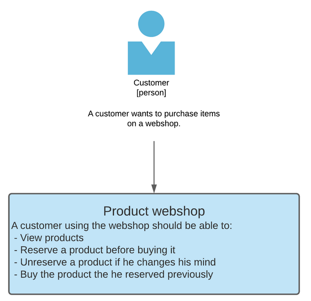
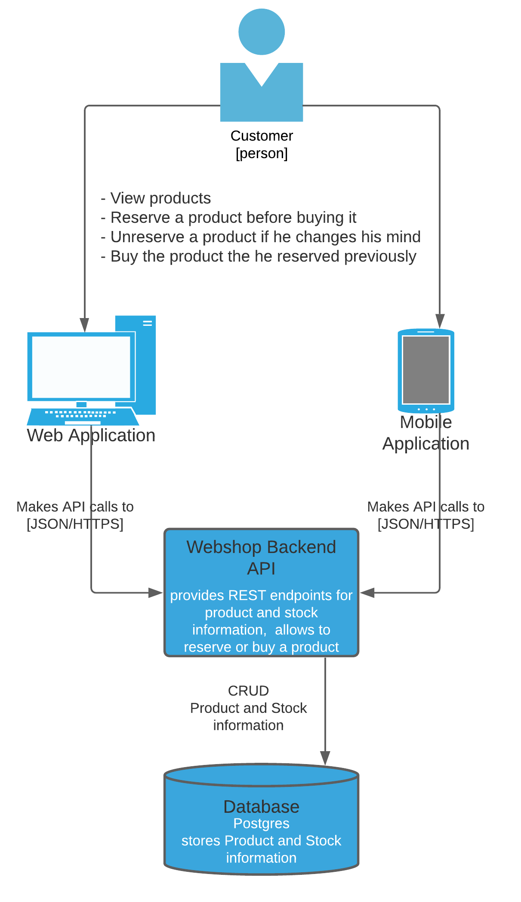
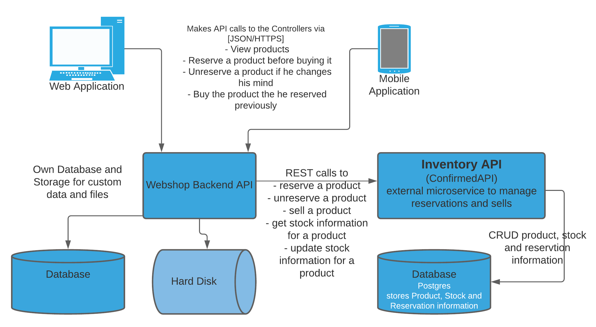

# Confirmed
confirmed API 1.0

ASP.NET Core Web API for an Inventory management of a webshop. The webshop would use the Inventory API (ConfirmedAPI) for the logic of managing, reserving and ultimately selling inventory.

## Context



## Containers



## Components



## Code

### Implementation Details

ASP.Net Core (5.0) Web Application, implemented in C#, using Visual Studio 2019. For database connection and data management it uses Entity Framework Core and supports SQL or InMemory Postgres database. \
The API exposes a Swagger UI for documentation and testing purposes.\
The application uses Dependency Injection to pass dependent implementations to the constructors. The data access layer uses the Repository pattern to separate the business logic from the core CRUD operations and from the model to DTO transformations.

The Solution contains 2 projects

#### ConfirmedAPI

##### Controllers

***ProductController***

It uses `IConfirmedRepository` for accessing the database for CRUD operations and exposes REST endpoints as follows:

- PATCH /product/:id/stock, with a payload consisting of a JSON Object that is formed as
follows:
```json
{"stock": 123}
```
This endpoint sets the stock that is available to be sold (i.e. IN_STOCK), overwriting any existing
values for IN_STOCK. If a record for the product does not exist, a new one is created.

- GET /product/:id
This endpoint returns a JSON Object returning the stock level for the product given in the following
form:
```json
{"IN_STOCK": 123, "RESERVED": 4, "SOLD": 12}
```
If there is no record for the given Product ID, the request returns a status code of 404 with an
arbitrary response body that must be ignored, otherwise the status code is a 200.
- POST /product/:id/reserve, without any payload. This call reserves one item of stock. On
success, a 200 status code is returned, with a response JSON that is having the following form

```json
{"reservationToken": "22489339-5462-458b-b184-fc1f55eedab5"}
```

This call moves stock from IN_STOCK to reserved. Should the IN_STOCK column have a value
lower than 1, this call returns a status code of 400 with an arbitrary response body that must be ignored. 
The Reservation Token is unique for one item of stock and is required to later mark an item of stock
as sold – without this token, both the unreserve (i.e. the inverse operation) and the final sold move
cannot be performed. It is the callers responsibility to keep track of this reservationToken.

- POST /product/:id/unreserve, with a JSON payload like this:

```json
{"reservationToken": "22489339-5462-458b-b184-fc1f55eedab5"}
```
This endpoint returns a 200 status code and moves one item of stock from RESERVED to IN_STOCK
if, and only if, the reservation token is recognised and belonging to the product ID indicated. After
the stock item has been moved to IN_STOCK again, it is not possible to use the reservation token
again, it can be destroyed by the caller.

- POST /product/:id/sold, with a JSON payload of

```json
{"reservationToken": "22489339-5462-458b-b184-fc1f55eedab5"}
```
This endpoint moves a stock unit from RESERVED to the state of SOLD, and only if the reservation
token is valid for this product. If successful, a 200 status code is returned, otherwise the response
is 400. After this operation is complete, the reservation token can no longer be used and can be
destroyed by the caller. 

##### Data
The `ConfirmedDbContext` represents the database schema and used in Entity Framework to create database schema.\
The schema consists of 3 tables:
 - Products
 - Stocks
 - Reservations

And has a few constraints which are defined on the Model classes and members and also within the `OnModelCreating` method.

The `IConfirmedRepository` maps CRUD operations to functions required by the controllers:
```csharp
        Product GetProduct(int productId);
        Stock GetStockForProduct(Product product);
        Stock CreateStockForProduct(Product product);
        void UpdateStock(Stock stock);
        Reservation GetReservation(int productId, Guid reservationID);
        Reservation AddReservatonForProduct(int productId);
        void RemoveReservationForProduct(Reservation reservation);
        void SellReservedProduct(Reservation reservation);
```

The connectionString must be configured in the `appSettings.json` file.

```json
  "ConnectionStrings": {
    "ConfirmedDbConnection": "User ID=<user>;Password=<password>;Server=<server>;Database=confirmed_db;Integrated Security=true;Pooling=true;"
  }
```

***Concurrency handling***

As it is more than possible the 2 identical calls might happen for the same Stock entry in the database, the `Stock` model has a special property `xmin` that is configured to use as a concurrency token in the PostgreSQL. It is configured in the `ConfirmedDbContext` within the `OnModelCreating` method:
```csharp
 modelBuilder.Entity<Stock>()
   .UseXminAsConcurrencyToken();
```
This ensures that whenever a row is updated while another call is dealing with the same row, the `xmin` value is automatically changed, and EntityFramework throws a `DbUpdateConcurrencyException` telling that concurrent write occured. This is handled with a simple retry loop within the `ConfirmedRepository` within the `RetryReservationUpdate` method.

More about Entity Framework and Database concurrency handling:

https://docs.microsoft.com/en-us/aspnet/mvc/overview/getting-started/getting-started-with-ef-using-mvc/handling-concurrency-with-the-entity-framework-in-an-asp-net-mvc-application

PostgreSQL specific:

https://www.npgsql.org/efcore/modeling/concurrency.html


##### DTO
Data Transfer Objects carry data between the different layers.
 - ReservationDTO: wraps the ReservationToken.
 - StockDTO: wraps the stock amount.
 - StockLevelDTO: maps stock information into stock levels.

##### Models
Contains the models classes used to create database schema.
 - Product: represents a product.
 - Reservation: represents a reservation.
 - Stock: represents a stock

#### ConfirmedAPITests

The tests project contains several test for the `ProductController`functions and also for the `ConfirmedRepository` and it covers all of the public methods. It uses prepopulated in-memory SQLite database for test data, that is configured in the `TestDb` class.

As the test uses SQLite instead of PostgreSQL as in the main project, the concurrency token is different, and that's why the `ConfirmedDbContextTest` is inherited from the `ConfirmedDbContext` and the `OnModelCreating` method is overridden to be able to configured the concurrency token to use `RowVersion` setting for the `xmin` property:
```csharp
modelBuilder.Entity<Stock>()
                    .Property(p => p.xmin)
                    .HasDefaultValue(1)
                    .IsRowVersion();
```

### Demo

The Confirmed web API is deployed to an AWS ElasticBeanstalk environment using the AWS SDK Tools in VisualStudio.
It uses and AWS RDS Postgres database for data persistance.

The Demo can be found here: http://confirmed-stock.us-east-1.elasticbeanstalk.com/swagger/index.html

### Notes, considerations

- The solution does not contain authentication or authorization. To improve security, auth layer or a separate could be added later.
- The solution is a simple web API, hosted in AWS in the demo. The ElastikBeanstalk provides several options for scalability, monitoring, alerting which could be easily used to prepare the service for incrementing load.
- Currently any size of images are allowed to upload, which could affect the perfomance, especially that the upload/download is synchronous. 
- For simplicity, the web method's response is HTTP 400 BadRequest in every case when an Exception occurs, otherwise HTTP 200 Ok.
- The Swagger UI is exposed also when not in development mode and it does not contain any AUTH.
- The code does not contain any logging, but NLog could be used for detailed logging.
- Exception handling, input validation and error handling could be further improved accross the code.
- ReservationTokens are generated and stored on server side currently. Later on this guid rely on a hashing logic of the request id and timestamp perhaps.
- Entitiy Framework does not support min/max values on integers, so the constraint of Stock >= 0 is enforced from the application code.

